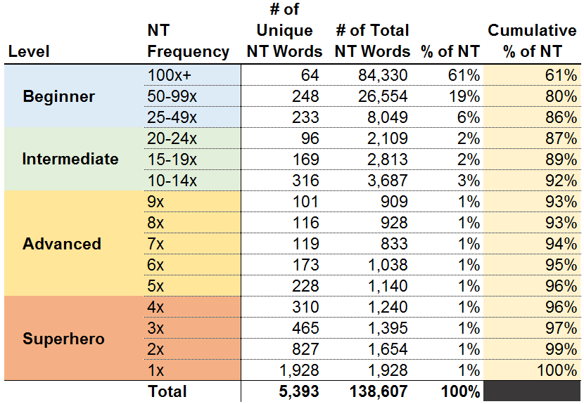

# Koine and the New Testament (Ἡ Κοινή Διαθήκη)

## Books of the New Testament

-Καινὴ or Κοινή.

- The use of the phrase "New Testament" (Ἡ Καινὴ Διαθήκη, Hē Kainḕ Diathḗkē) to describe a collection of first and second-century Christian Greek scriptures can be traced back to Tertullian in his work Against Praxeas

- Learning Attic is very useful for religious students as well. Many Fathers of the Church studied the ancient authors and wrote in a rather atticized koine.

- If you really only want to read the New Testament, or perhaps the Septuagint, Koine is slightly simpler and you might as well learn it directly. There are some great recent textbooks (e.g. by Decker, Schwant and others).

- Do not start with Modern Greek. They are mutually incomprehensible, separate languages, with different grammars and different vocabularies.

- The writers were strongly influenced by Hebrew and Aramaic, in which the verb is placed first in the sentence and is often accompanied by particles, in Greek δέ and καί, which may also stand before the verb.

- nice site (/u/koine_jay) -- <https://biblicaltext.com>

- <https://frame-poythress.org/keyboard-entry-of-polytonic-greek-and-biblical-hebrew-in-gnulinux-2014/>

```bash
sudo apt install ibus-m17n -y
```

### Statistics

- 260 verses
- 27 books
- NT_BOOKS = [Matthew, Mark, Luke, John, Acts, Romans, 1 Corinthians, 2 Corinthians, Galatians, Ephesians, Philippians, Colossians, 1 Thessalonians, 2 Thessalonians, 1 Timothy, 2 Timothy, Titus, Philemon, Hebrews, James, 1 Peter, 2 Peter, 1 John, 2 John, 3 John, Jude, Revelation]
- KD_BOOKS=["ΚΑΤΑ ΜΑΤΘΑΙΟΝ", "ΚΑΤΑ ΜΑΡΚΟΝ", "ΚΑΤΑ ΛΟΥΚΑΝ", "ΚΑΤΑ ΙΩΑΝΝΗΝ", "ΠΡΑΞΕΙΣ ΤΩΝ ΑΠΟΣΤΟΛΩΝ", "ΠΡΟΣ ΡΩΜΑΙΟΥΣ", "ΠΡΟΣ ΚΟΡΙΝΘΙΟΥΣ Α΄", "ΠΡΟΣ ΚΟΡΙΝΘΙΟΥΣ Β΄", "ΠΡΟΣ ΓΑΛΑΤΑΣ", "ΠΡΟΣ ΕΦΕΣΙΟΥΣ", "ΠΡΟΣ ΦΙΛΙΠΠΗΣΙΟΥΣ", "ΠΡΟΣ ΚΟΛΟΣΣΑΕΙΣ", "ΠΡΟΣ ΘΕΣΣΑΛΟΝΙΚΕΙΣ Α΄", "ΠΡΟΣ ΘΕΣΣΑΛΟΝΙΚΕΙΣ Β΄", "ΠΡΟΣ ΤΙΜΟΘΕΟΝ Α΄", "ΠΡΟΣ ΤΙΜΟΘΕΟΝ Β΄", "ΠΡΟΣ ΤΙΤΟΝ Α΄", "ΠΡΟΣ ΦΙΛΗΜΟΝΑ Α΄", "ΠΡΟΣ ΕΒΡΑΙΟΥΣ Α΄", "ΙΑΚΩΒΟΥ Α΄", "ΠΕΤΡΟΥ Α΄", "ΠΕΤΡΟΥ Β΄", "ΙΩΑΝΝΟΥ Α΄", "ΙΩΑΝΝΟΥ Β΄", "ΙΩΑΝΝΟΥ Γ΄", "ΙΟΥΔΑ", "ΑΠΟΚΑΛΥΨΙΣ ΙΩΑΝΝΟΥ"]
- GREEK_LETTERS = ['α', 'β', 'γ', 'δ', 'ε', 'ζ', 'η', 'θ', 'ι', 'κ', 'λ', 'μ', 'ν', 'ξ', 'ο', 'π', 'ρ', 'σ', 'τ', 'υ', 'φ', 'χ', 'ψ', 'ω']
-
- 138,607 total words in the Greek New Testament
- 5,394 total unique words.

Of these unique words, the vast majority of them only occur a few times, while some occur hundreds of times.



### Read alongs

- <https://dailydoseofgreek.com/scripture-passage/john/john-1-1/>

- Attic Greek? - Lingua Graeca per se illustrata (audio and text): <https://www.patreon.com/posts/32583991>

### Pronunciation / orthography

**homonyms** same pronunciation, different orthography. `beet` vs `beat`
**Phonemic** refers to the sounds of a language that make a distinction in meaning.

- `Stop` and `top` pronounced differently. These differences do not have phonemic meaning in English. They are **etic** (different sounds no semantic meaning) NOT **emic** (different sounds have semantic meaning).
- /tʰ/ in `top`
- /t/ in `stop`
- (initial) rho always takes rough breathing... ρἁββι ?? "r" is a kinda vowel, maybe??

- Accent was pitch-based, not stress (English).
- ή for the οκσεῖα 'acute' accent or high pitch
- ῆ for the περισπώμενον accent or high-low pitch
- ὴ for the βαρεῖα 'grave' or falling pitch.

- Erasmus (1466-1536) Lion and Bear discus pronumciation in *Dē Rēctā Latīnī Graecīque Sermōnis Prōnūntiātiōne*
- 🏺  Lucian Pronunciation of Ancient Greek:
<https://youtu.be/Dt9z5Gvp3MM>
- 📄  Ancient Greek Pronunciation Guide:
<http://bit.ly/**ranierigreekpronunciationguide**>
- 🕰  Ranieri's Greek Pronunciation Chronology Spreadsheet:
<https://bit.ly/ranierigreekpronunciation>​
- 🐢 Learn Ancient Greek with my Comprehensible Input video series Ancient Greek in Action!
<https://www.youtube.com/playlist?list=PLU1WuLg45SixsonRdfNNv-CPNq8xUwgam>
- Buth: <https://www.biblicallanguagecenter.com/koine-greek-pronunciation/>

### Metre

- LATIN METRE: <https://www.youtube.com/playlist?list=PLQQL5IeNgck0-tQ4AZgKFMlQCJud_VY_H>

Where vowel quantity is a thing:
**dibrach** - short-short
**iamb** - short-long
**trochee** - long-short
**spondee** - long-long

Where stress is a thing:
Trochees: two beats - stressed-unstressed
Iambs: two beats - unstressed-stressed
Spondee: two beats - stressed-stressed
Dactyl: three beats - stressed-unstressed-unstressed
Anapest: three beats- unstressed-unstressed-stressed

#### Dipthongs

- Duff, NT Greek, 1.4-6, Diphthongs and iota subscripts: <https://www.youtube.com/watch?v=O81kYTg0-ic&list=PLLsORYeo0a66wYX81WQpy8EtEze14vERn&index=5>
- IPA Reader: <http://ipa-reader.xyz/>

| greek    | translit. | mod. IPA | mounce | pron. 3 |
|---       |---        |---       |---     |---      |
| αι       | ai        |          | eye    | |
| ει       | ei        | /i/      | h*ay*  | |
| οι       | oi        |          | *oi*l  | |
| υι       | ui        |          | q*ui*  | |
| αυ       | au        |          | h*ow*  | |
| ου       | ou        |          | h*oo*p | |
| ευ / ηυ  | eu        |          | f*eu*d | |

/i/ == m*ee*, but short
/aː/ == h*ay* -- Erasmian

Essential changes from Erasmian to Lucian...
Nice reading from Xenophon at the end: <https://www.youtube.com/watch?v=ponGrCwjYWo>
ει → /iː/
ζ  → /zː/
β  → /β/ or /v/
δ  → /ð/
γ  → /ɣ~ʝ/

 if η is pronounced like h**ay** then clashes with ει dipthong. So

Some Latin words with [v,w] transcribed in Greek with [β].  Historically, the Latin sound was transcribed with ου in Greek.

πρεβέτοις        for the Latin [privatus] (1st century CE)

Φλαβία            for the Latin [Flavia] (149 CE)

Φλαουβίου  and  Φλαυβίας         for the Latin [Flavius/-a] (120 CE)

Suggests ου should be like Spanish `v`/ English `f`

### Vocabulary

- Transliteration scheme, where employed, is that used for input at: <https://www.lexilogos.com/keyboard/greek_ancient.htm>
- below vocab comes from  Jonathan Wilkins's "Learning New Testament Greek". E.g. <https://www.youtube.com/watch?v=9mnYA81H9yM&list=PLv6naiTTHUgVdmeByLApE0qS7PkuVpuzO&index=23>

#### Verbs

|Strong|lexeme   |transl.    |Eng.                          |
|---   |---      |---        |---                           |
|71    | ἂγω     |hha'gw     | I lead                       |
|00    | βάλλω   |ba'llw     | I throw                      |
|00    | ἁκούω   |hhakou'w   | I hear                       |
|00    | γράφω   |gra'phw    | I write                      |
|00    | γινώσκω |ginw'sko   | I know (through experience)  |
|00    | ἔχο     |hhe'khw    | I have                       |
|00    | θέλω    |the'lw     | I wish,  want,  desire       |
|00    | κρίνω   |kri'nw     | I judge                      |
|00    | λέγω    |le'gw      | I say                        |
|00    | λύω     |lu'w       | I loose, destroy             |

#### PIA

| s      | pl         |
|---     |---         |
| λέγω   | λέγομεν    |
| λέγεις | λέγετε     |
| λέγει  | λέγοισιν   |

#### Nouns

|Lexeme      |Art.|Eng.                              |
|---         |--- |---                               |
| ἄγγελος    | ὁ  | messenger                        |
| καῥπός     | ὁ  | fruit                            |
| λογός      | ὁ  | word                             |
| ἀπόστολος  | ὁ  | apostle                          |
| ἄνθρωπος   | ὁ  | man/mankind                      |
| δοῦλος     | ὁ  | slave/servant                    |
| ἑργον      | τό | work                             |
| Θεός       | ὁ  | God                              |
| τέκνον     | τό | child/son (metaphorical)         |
| υἱός       | ὁ  | actual son (child)               |
| ἁαδελφός   | ὁ  | brother                          |
| αἴματος    | ὁ  | blood                            |
| αἴρω       | -- | I raise                          |
| ἀποκτείνω  | -- | kill                             |
| βλέπω      | -- | I see                            |
| ἐσθιω      | -- | I eat                            |
| κοσμος     | ὁ  | world                            |
| πλοῖν      | τό | boat                             |
| συνάγω     | -- | I bring together (*synagogue)    |

<https://www.billmounce.com/greek-dictionary/artos>
Dictionary:
ἄρτος, -ου, ὁ
Greek transliteration:
artos
Simplified transliteration:
artos
Numbers
Strong's number:
740
GK Number:
788
Statistics
Frequency in New Testament:
97
Morphology of Biblical Greek Tag:
n-2a
Gloss:
(loaf of) bread, food
Definition:
bread; a loaf, or thin cake of bread, Mt. 26:26; food, Mt. 15:2; Mk. 3:20; bread, maintenance, living, necessaries of life, Mt. 6:11; Lk. 11:3; 2 Thess. 3:8

TODO: Mounce#, Blacks#, Freq.

#### Article

- When a noun is used without the article it is **anarthrous**.

> 💡 **Idiom**: N-P nouns will often take a singular verb.
E.g τά τέκνα **ἐχει**... (the children **has**...) not τά τέχνα ἐχουσιν...

|Case|M-S |M-P   |   |N-S  |N-P  |
|--- |--- |---   |---|---  |---  |
|Nom |ὁ   | ὁι   |   | τό  | τά  |
|Gen |τοῦ | τῶν  |   | τοῦ | τῶν |
|Dat |τῷ  | τοῖς |   | τῷ  | τοις|
|Acc |τόν | τούς |   | τό  | τά  |

#### 2nd Declenison endings

|Case| M-S | M-PL|   | N-S | N-PL|
|--- |---  |---  |---|---- |---- |
|Nom | ος  | οι  |   | ος  | οι  |
|Gen | ου  | ων  |   | ου  | ων  |
|Dat | ῳ   | οις |   | ῳ   | οις |
|Acc | ον  | ους |   | ον  | α   |
|Voc | ε   | οι  |   | ον  | α   |
